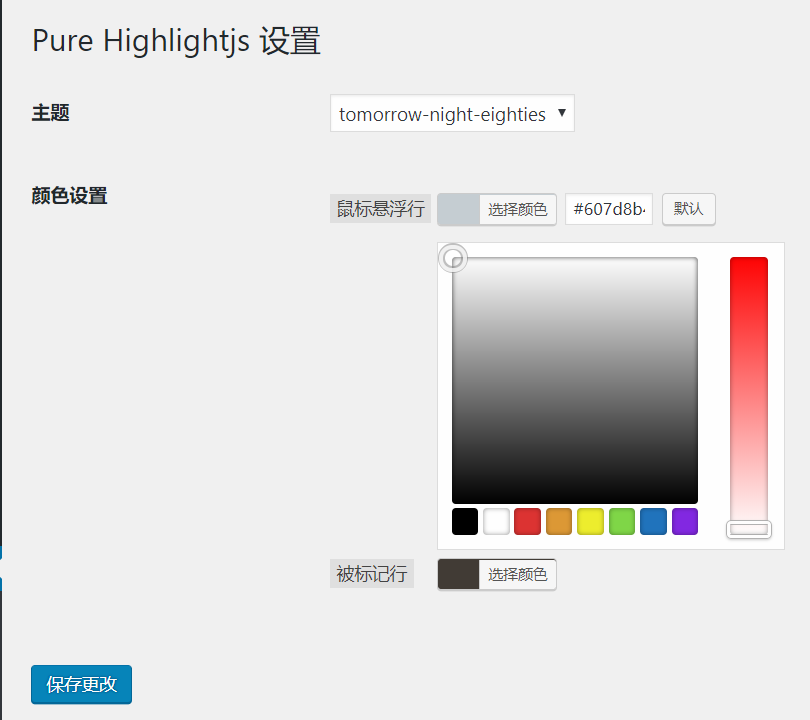

# Pure-Highlightjs

A lightweight syntax highlighter for WordPress

一个可以在编辑器中可视化选择代码语言和插入代码的 WordPress 插件。

利用 highlightjs 来实现代码高亮。

可以显示行号、鼠标悬浮高亮和被标记行高亮

## 预览图


>上图为代码高亮、显示行号、鼠标悬浮行高亮和被标记行高亮


>上图为颜色设置界面

## 显示行号

代码参考自：[给博客的highlight.js添加行号和行号高亮](https://xuexb.com/post/highlight-showline.html)

## Dependents

[highlight.js](https://highlightjs.org/ "highlight.js")

## BugList *必看*

和 `</code></pre>` 在同一行的代码不被显示，原版插件在插入代码时代码最后和结束标签连在一起，因此使用了显示行号 JS 脚本后会导致原来文章中代码最后一行不显示。

解决方法：手动修改之前的文章，或者用 SQL 语句批量更改之前文章中的 “`</code></pre>`”

改为 “

`</code></pre>`
”

即将代码最后一行和 `</code></pre>` 之间用换行隔开。

SQL 语句为：

```sql
UPDATE wp_posts
SET post_content = replace( post_content, '</code></pre>', '
</code></pre>' );
```

此项目中已经将插件的插入代码部分做了修改，在插入代码时自动将代码和结束标签间用换行隔开。

## 安装方法

前往 [Release](https://github.com/sunriseydy/Pure-Highlightjs/releases "Release") 页面下载打包好的 zip 压缩包，在 WordPress 插件页面点击安装插件，再点击上传插件，选中下载好的插件压缩包即可。

## 具体教程

[纯代码让 pure-highlightjs 插件能够显示代码行号(已更新插件)](https://blog.sunriseydy.top/technology/server-blog/wordpress/pure-highlightjs-with-line-number/ "纯代码让 pure-highlightjs 插件能够显示代码行号(已更新插件)")

## License

The MIT License.

Copyright (c) 2016 iCodeChef
